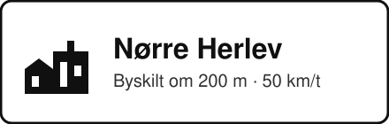

# karoo-citylimit

A [Hammerhead Karoo](https://www.hammerhead.io/) extension that alerts you when you are about to
ride **into** a town — and stays quiet when you ride out of one.

> **På dansk:** Udvidelsen giver en besked på Karoo'en når du nærmer dig et byskilt ved indkørsel
> til en by. Byskilte med streg over (ophør af tættere bebygget område) giver aldrig besked.



## What it does

* Watches your position while you ride and shows an in-ride alert (optionally with a beep) roughly
  200 m before a town-entry sign.
* Only the **entry** side of a town boundary is announced. The crossed-out sign you pass on the way
  out is ignored.
* Works offline once the area has been downloaded, and can prefetch every town along a loaded route.

## How "entry only" is decided

Town boundaries come from OpenStreetMap. Two things have to be true before you get an alert:

1. **The sign is an entry sign.** Nodes that only carry the crossed-out variant — `DK:E56`,
   `DE:311`, `SE:E6`, `city_limit=end`, … — are dropped while parsing. In Denmark most boundaries
   are mapped as a single `traffic_sign=city_limit` node that is an entry sign in one direction and
   an exit sign in the other, so a second check is needed.
2. **You are riding into the town, not out of it.** Each sign is matched to the `place` of its town,
   and the bearing from the sign towards that town centre is the direction a rider enters in; your
   heading has to be within 80° of it. Riding out of town points the other way, so no alert is
   raised.

   A sign that carries a name names its own town, so only a place with that name is accepted — if
   none is mapped, the sign has no known direction and is skipped. Names are compared ignoring
   spacing, so the sign "Vesterlyng" finds the hamlet "Vester Lyng", and a sign may drop the
   regional qualifier a place carries: "Nykøbing" matches "Nykøbing Sjælland". That last rule only
   applies when it is unambiguous — "Nykøbing" also prefixes the hamlet "Nykøbing Lyng", so the more
   significant place wins, and a tie between equals means no match rather than a guess. Falling back to the nearest place
   for a named sign points the arrow at whatever village happens to be closest: signs reading
   "Lyngen" in Odsherred, where no place of that name exists, ended up pointing at neighbouring
   hamlets, and at a different one depending on which area had been downloaded. Only a sign with no
   name at all falls back to the nearest place, preferring a mapped node over the centre of an area.

   Places are collected from 5 km beyond the area the signs come from, so a sign near the edge can
   still find the town it names, and the same sign always resolves the same way regardless of which
   cell it was looked up from.

On top of that the sign has to lie ahead of you (within 55° of your heading) and inside the alert
distance, and each town is only announced once per ten minutes.

Signs where no town could be matched have no known direction. Those are skipped by default; the
setting *Also alert when direction is unknown* turns them on if you would rather have a few extra
alerts than miss a town.

## Sign data

Data is queried from the [Overpass API](https://overpass-api.de/) in grid cells of roughly 5 × 6 km
and cached on the device for 90 days. Each query returns the sign nodes plus the places used for
direction, the latter as nodes, ways and relations with `out center` so an area's centre comes back
without its full geometry. The cache means a route you ride often needs no connection at all.
Requests go through the Karoo system's HTTP API, which uses Wi-Fi when available and otherwise the
companion phone over Bluetooth. Downloads are spaced at least 4 seconds apart and back off on
errors.

The following national sign codes are recognised, in addition to the generic `traffic_sign=city_limit`:

| Country | Entry | Exit |
| --- | --- | --- |
| Denmark | `DK:E55` | `DK:E56` |
| Germany | `DE:310` | `DE:311` |
| Austria | `AT:53-17a` | `AT:53-17b` |
| Switzerland | `CH:4.27`, `CH:4.29` | `CH:4.28`, `CH:4.30` |
| Sweden | `SE:E5` | `SE:E6` |
| Norway | `NO:365` | `NO:366` |
| Finland | `FI:571` | `FI:572` |
| Netherlands | `NL:H01` | `NL:H02` |
| Belgium | `BE:F1` | `BE:F3` |
| France | `FR:EB10` | `FR:EB20` |
| Spain | `ES:S-500` | `ES:S-510` |
| Poland | `PL:D-42` | `PL:D-43` |
| Czechia | `CZ:IZ4a` | `CZ:IZ4b` |

Sign data © OpenStreetMap contributors, available under the
[Open Database License](https://www.openstreetmap.org/copyright).

## Region packs

Riding an area once caches it for 90 days, and a loaded route is prefetched cell by cell — but both
still need a connection the first time. A region pack removes that: it puts a whole country on the
device before you leave home.

Packs are built by `tools/build-packs.mjs`, which asks Overpass for a country tile by tile, runs the
same classification and town matching as the extension, and writes the result as grid cells split
into files under 100 KB — small enough to also come through the Karoo system's HTTP API when the
device has no Wi-Fi of its own. `.github/workflows/packs.yml` rebuilds them monthly and publishes
them under the fixed `packs` release, so the download URL never changes. That release is marked as a
pre-release on purpose: GitHub resolves `/releases/latest` to the newest release that is neither
draft nor pre-release, and the app reads `manifest.json` from there to find updates — an ordinary
packs release takes that spot and the update check starts returning 404. Overpass is then queried
once per rebuild instead of once per rider per area.

On the device, *Download a region* in the settings screen lists what is available and installs a pack
straight into the sign cache. Denmark holds around 9,000 town-entry signs, which comes to roughly a
megabyte spread over some 16 files — a rounding error next to the map downloads on the device.

Signs are clipped to the region's own borders, so the Danish pack does not quietly carry Skåne and
Schleswig along with it. Places are deliberately not clipped: a sign near a border still has to find
the town it names, whichever country that town is in.

Building or adding a region locally:

```bash
node tools/build-packs.mjs --region dk --out build/packs
node tools/build-packs.mjs --region dk --bounds 55.8,11.4,56.0,11.8   # a corner, for a quick try
```

A new country is a few lines in `REGIONS` at the top of the script: an id, a display name, its
bounding box, and how finely to tile the Overpass queries.

## Settings

Open **City Limit** from the Karoo app list, or map the *City Limit settings* bonus action to a
controller button.

| Setting | Default | |
| --- | --- | --- |
| Alerts | on | Master switch |
| Only while recording | on | Stay quiet until a ride is being recorded |
| Beep | on | Short two-tone beep with the alert |
| Alert distance | 200 m | 100 / 150 / 200 / 300 / 500 m |
| Alert duration | 8 s | 4 / 6 / 8 / 12 s |
| Download while riding | on | Fetch the area ahead and any loaded route |
| Also alert when direction is unknown | off | See above |

The screen also shows how much data is cached, lets you download the current area on demand, clear
the cache, and preview what an alert looks like.

## Verification map

`tools/verify-map.html` is a standalone page for checking the data and the logic on a map before
trusting it on the road. Serve it over http and open it in a browser — no build step:

```bash
python3 -m http.server 8000     # from the repository root
# then open http://localhost:8000/tools/verify-map.html
```

Opening the file directly from disk does not work: the browser then sends `Origin: null`, which
Overpass rejects (406), so no data can be downloaded. The page says so if you try.

For a permanent URL — handy for checking an area from a phone — the page can be hosted as a static
site. `netlify.toml` in the repository root configures that already: at netlify.com choose *Add new
site → Import an existing project*, pick this repository, and deploy. There is no build step; the
`tools/` directory is published and `/` redirects to the map. Every push to the default branch
redeploys it.

Hosted, the page reaches both the packs (`/api/packs/…`) and Overpass (`/api/overpass`) through
functions on its own origin. The packs need it because GitHub redirects release downloads to a host
that sends no CORS headers; Overpass needs it for a different reason. Overpass serves server-to-server requests happily but answers the same query from a
browser with `406`, which then surfaces as a CORS error because the error response carries no CORS
headers; going through the proxy means Overpass sees an ordinary server call. Served from localhost
there is no proxy, so the page calls Overpass directly with `referrerPolicy: no-referrer`. GitHub Pages works just as well if you would rather not add a second service — say the
word and the workflow for it is a few lines.

* Reads the published region pack by default — the same data the Karoo carries — so checking an area
  needs no Overpass at all. The pack loads once and stays in the browser, so panning is instant.
  Switching the data source to *Overpass (live)* queries OpenStreetMap directly instead, which is the
  way to see signs that have been mapped since the last pack was built.
* Draws every town-entry sign with an arrow for the direction that counts as riding in, marks signs
  with no known direction in orange, and greys out nodes that were dropped for carrying only the
  crossed-out sign. Clicking a sign shows its OSM tags and which place node it was matched to.
* Lets you draw a route and run it in both directions, placing a bell where an alert would fire —
  so "town announced riding in, silence riding out" is something you can see.

The page carries its own copy of the decision logic; `node tools/verify-map-parity.mjs` checks it
against the same fixtures the Kotlin tests use, and CI runs that check on every push.

## Project layout

```
core/   Pure Kotlin: geometry, sign classification, Overpass query/parsing, approach detection
app/    Android app: the Karoo extension service, sign cache/downloader and the settings screen
tools/  Verification map, its parity check, and the region pack builder
.github/workflows/  Tests and debug build on every push, signed release on every version tag,
                    region packs rebuilt monthly
```

All of the decision logic lives in `core/` and is covered by unit tests, including a simulated ride
through a real village using a recorded Overpass response.

## Installing on the Karoo

Grab `citylimit.apk` from the [latest release](https://github.com/ttopholm/karoo-citylimit/releases/latest)
and sideload it over adb — the Karoo needs USB debugging enabled (Settings → About → tap the build
number, then Developer options):

```bash
adb install -r citylimit.apk          # over USB
# or over Wi-Fi, with the Karoo's IP:
adb connect 192.168.1.42:5555 && adb install -r citylimit.apk
```

The app declares `io.hammerhead.karooext.MANIFEST_URL`, pointing at `manifest.json` in the latest
release, so Karoo OS can show the app's details and offer later versions as updates without another
sideload.

## Releases

Releases are built by GitHub Actions, not by hand:

1. Bump `versionName` and `versionCode` in `app/build.gradle.kts` — Karoo compares `versionCode`
   to decide whether an update exists.
2. Tag and push: `git tag -a v1.1 -m "What changed" && git push origin v1.1`.

The workflow runs the tests, refuses the tag if it does not match `versionName`, then publishes the
signed APK, a `manifest.json` generated from `app/karoo-manifest.json` with the version and download
URLs filled in, and the app icon. The tag's message becomes `releaseNotes` in the manifest.

**Signing matters for updates.** Android refuses to update an app when the signing key changes, so
CI signs with a key held in repository secrets. Create one once and add it:

```bash
keytool -genkeypair -v -keystore release.jks -alias citylimit \
  -keyalg RSA -keysize 2048 -validity 10000

# One long line to paste as the KEYSTORE_BASE64 secret. Works on both macOS and Linux
# (`base64 -w0` is GNU-only and fails on macOS):
base64 < release.jks | tr -d '\n'
```

On macOS, add `| pbcopy` to put it straight on the clipboard.

Then add four secrets under Settings → Secrets and variables → Actions:

| Secret | Value |
| --- | --- |
| `KEYSTORE_BASE64` | the single line printed above |
| `KEYSTORE_PASSWORD` | the password you chose when creating the keystore |
| `KEY_ALIAS` | the name of the key inside the keystore — `citylimit` above |
| `KEY_PASSWORD` | the same password as `KEYSTORE_PASSWORD` |

A keystore holds one or more named keys, each with its own password in principle. In practice
`keytool` creates a PKCS12 keystore, where the store and key passwords have to match — it prints
*"Different store and key passwords not supported for PKCS12 KeyStores"* if you try otherwise.
`keytool -list -keystore release.jks` shows the alias of an existing keystore. Keep `release.jks` out of the repository and back it up: losing it
means every install has to be removed before the next version can be installed. Without the secrets
the workflow still builds, but signs with the debug key and warns that updates will not apply.

## Building

```bash
./gradlew :core:test        # unit tests
./gradlew :app:assembleDebug
adb install -r app/build/outputs/apk/debug/app-debug.apk
```

The `karoo-ext` library is resolved from JitPack (`com.github.hammerheadnav:karoo-ext`), which needs
no credentials. Hammerhead also publishes it to GitHub Packages as `io.hammerhead:karoo-ext`, which
requires a personal access token; switch the repository in `settings.gradle.kts` if you prefer that.

Release builds are signed with the debug key so they can be sideloaded; supply your own signing
config in `app/build.gradle.kts` if you need a different one.

## Limitations

* Alerts depend on how well town boundaries are mapped in OpenStreetMap. A sampling of one ~11 × 13
  km area per country found signs in DK, DE, NL, AT, IT, BE, CZ, PL, ES, FI, UK and US — around 300
  signs, all of which resolved a direction — but none at all in the sampled areas of SE, NO, FR and
  CH, where nobody has mapped the boundaries. Check your own area on the verification map before
  relying on it.
* `direction=forward/backward` on a sign node is relative to the way it sits on, which needs road
  geometry that would blow past the size limit for in-ride requests. The town-centre bearing is
  used instead — it agrees with the tagging in the areas this has been checked against.
